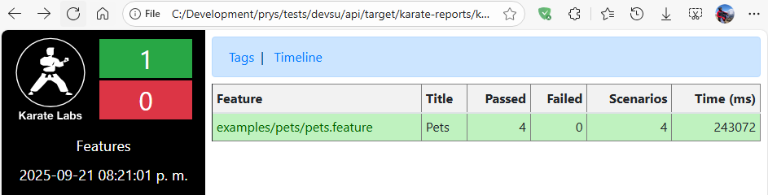
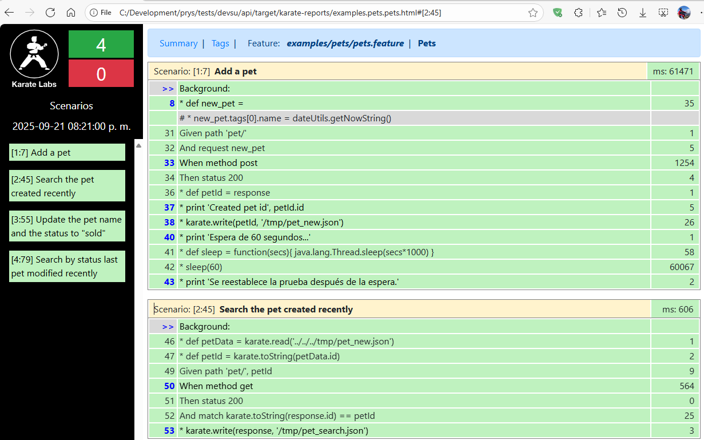
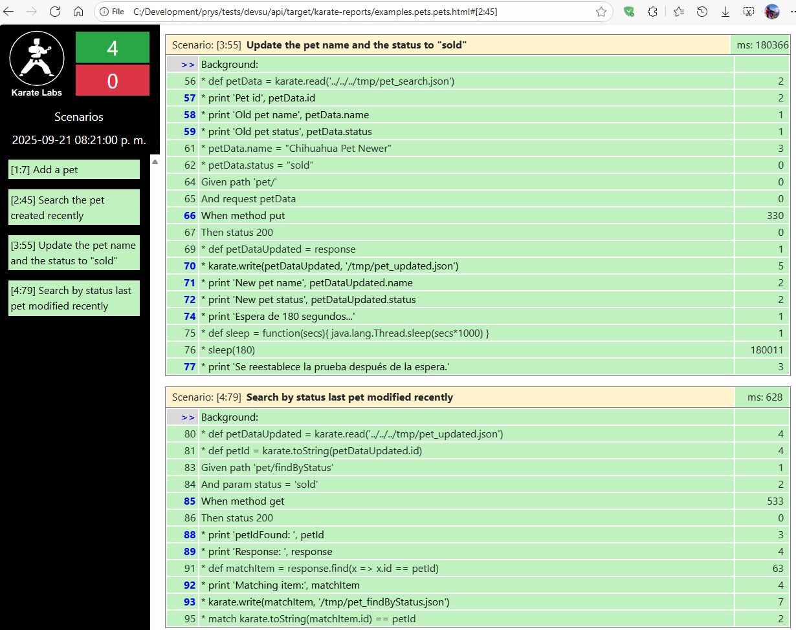
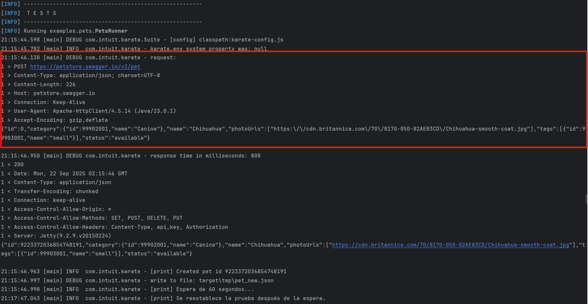
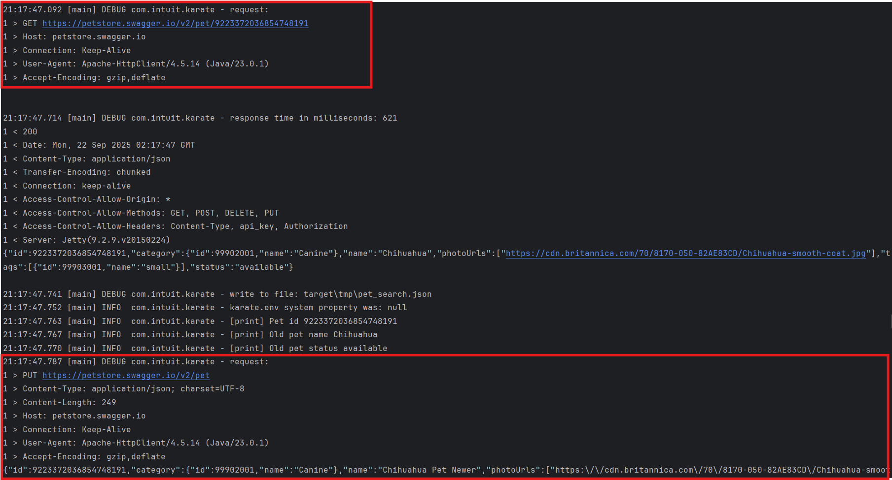
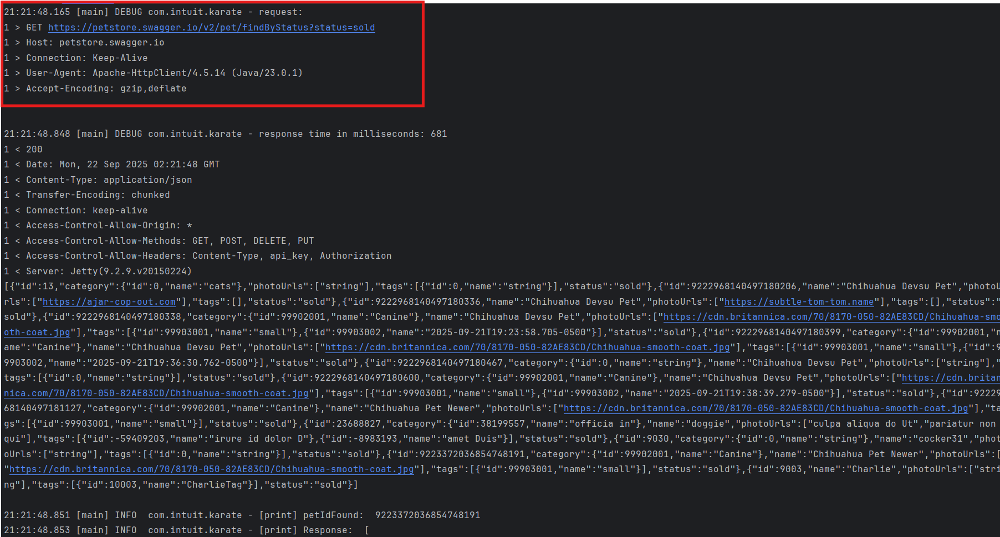
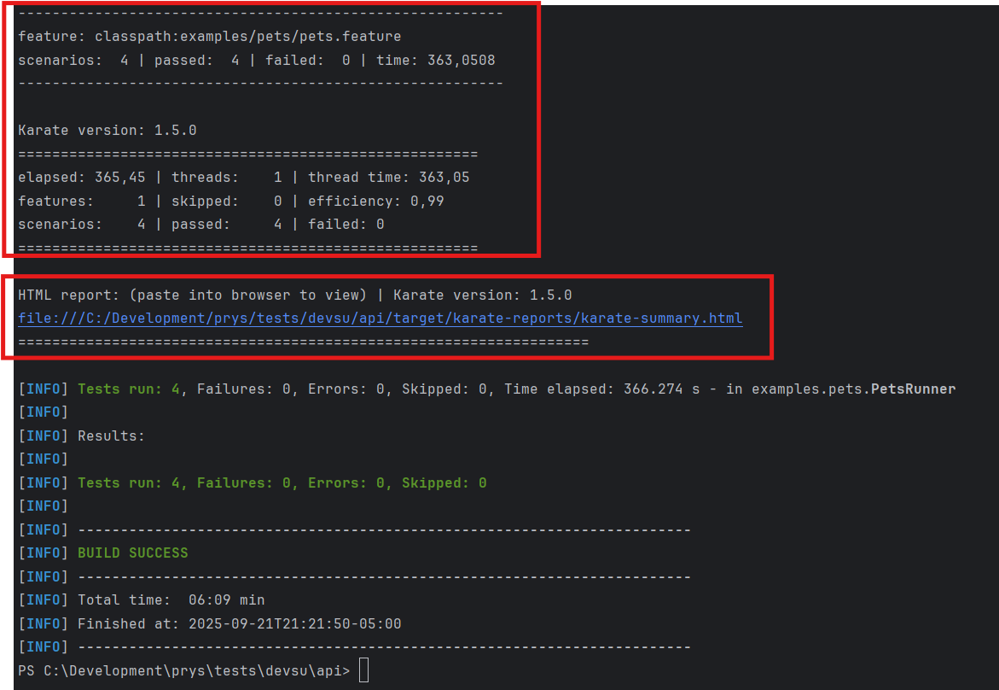

# AUTOMATIZACIÓN API TEST
Esta prueba de API permite validar el flujo siguiente:
- Añadir una mascota en la tienda
- Consutar una mascota ingresada previamente
- Actualizar el nombre de la mascota y el estatus de la mascota a "sold"
- Consultar la mascota modificada por estatus (Búsqueda por status)

## Implementación
Este flujo de prueba se ha implementado en un solo archivo, ubicado en:
[src/test/java/examples/pets/pets.feature](src/test/java/examples/pets/pets.feature)

## Instrucciones - Paso a pasa de ejecución
1. Ya en el repositorio, abrir la terminal en el directorio :
   ```  cd api ```
2. Descarga de dependencias y compilación del proyecto:
   ```  mvn clean install ```
3. Ejecución de la prueba:
   ``` mvn clean test ```
4. Si se desea ejecutar especificamente el archivo de prueba:
   ``` mvn clean test -Dtest=PetsRunner ```
5. Revisión del reporte generado
   [file:///<UBICACIÓN_DEL_REPOSITORIO>/api/target/karate-reports/examples.pets.pets.html](target/karate-reports/examples.pets.pets.html)
6. Revisión de la evidencia con capturas de pantalla:
   [Capturas](#capturas-de-pantalla)

## Archivo POM de configuración
El archivo de configuración POM está definido en:
[pom.xml](pom.xml)

## Reporte
Por cada ejecución de pruebas se crea un reporte visual, para ver el estado de la última prueba realizada, revise el archivo ubicado en la ruta:

[file:///<UBICACIÓN_DEL_REPOSITORIO>/api/target/karate-reports/examples.pets.pets.html](target/karate-reports/examples.pets.pets.html)


Reporte generado por cada prueba ejecutada

### Seguimiento de las pruebas en la reportería
Se puede observar los 4 escenarios de pruebas:
- **1: Añadir una mascota y 2: Consultar la mascota creada por ID** 
  

- **3: Actualizar el nombre y estatus; y 4: Consultar por estatus la mascota modificada**
  

## Hallazgos y Concluciones
Para revisar los hallazgos y las conclusioines encontradas en estas pruebas revisar el archivo:
[conclusiones.txt](conclusiones.txt)

## Evidencias de ejecución vía consola
A continuaión se colocan las evidencias de la prueba ejecutada vía consola:

<figure>

</figure>

<figure>

</figure>

<figure>

</figure>

<figure>

<figure-caption>Evidencia de la prueba.</figure-caption>
</figure>


## Autor
Lugar y fecha: Quito, 21 de septiembre de 2025

Prueba y flujo definido por Andrés Rosero

Correo electrónico: andres.rosero@outlook.com

Contacto: +593 99 923 5692
