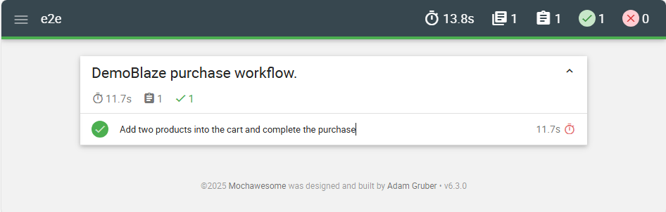
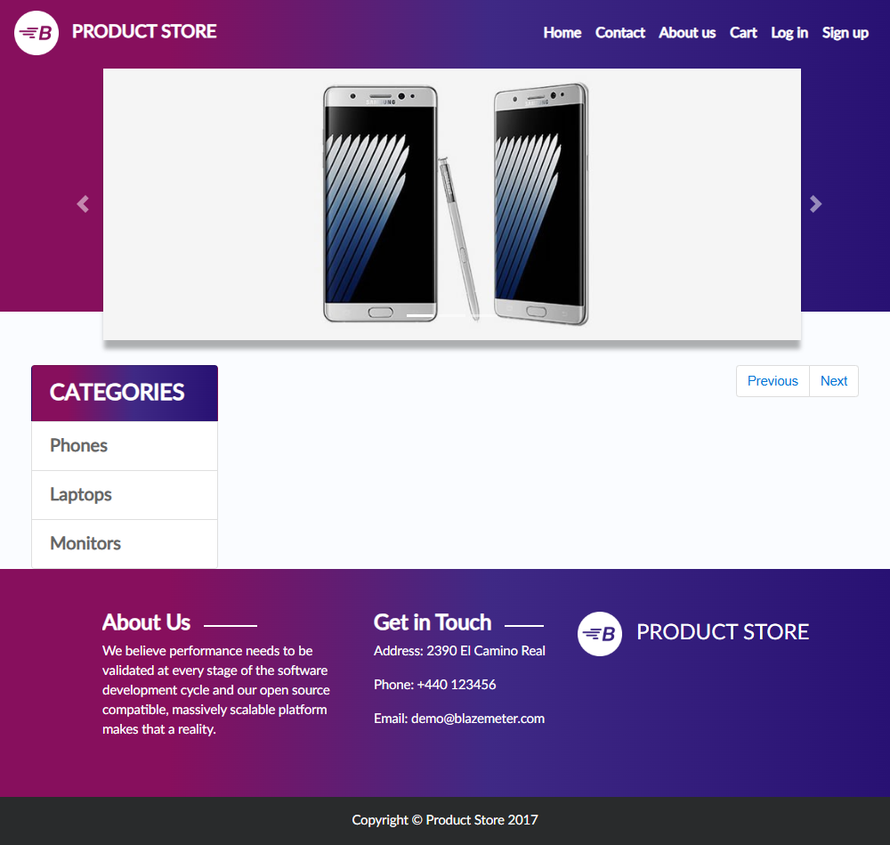
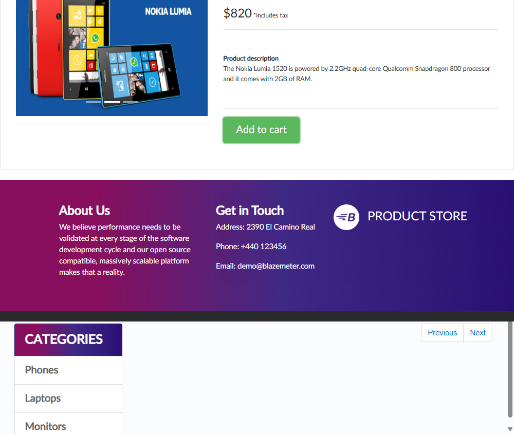
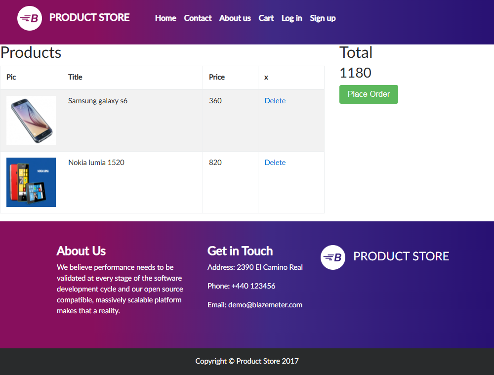
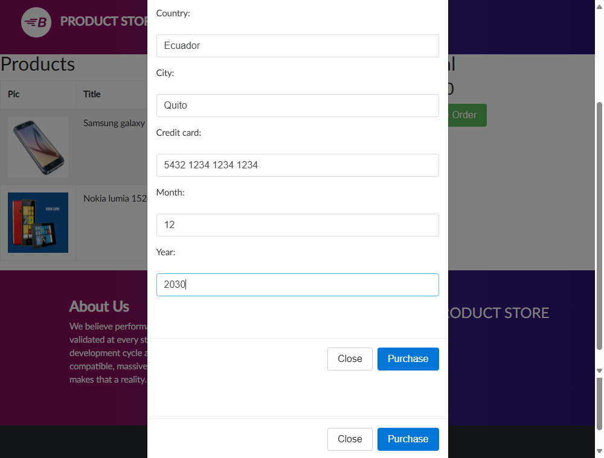
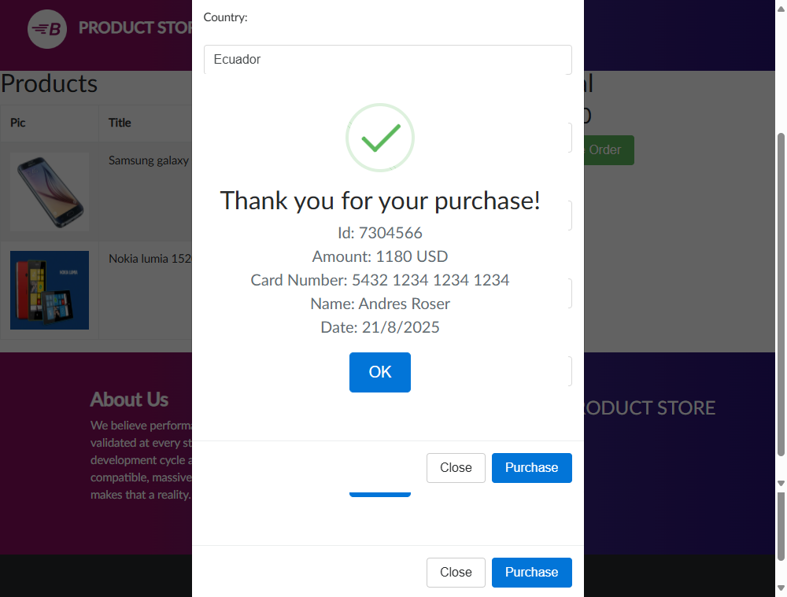
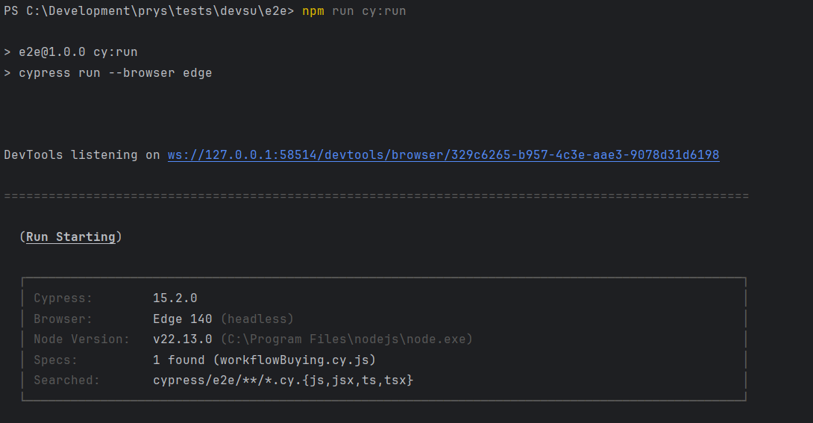
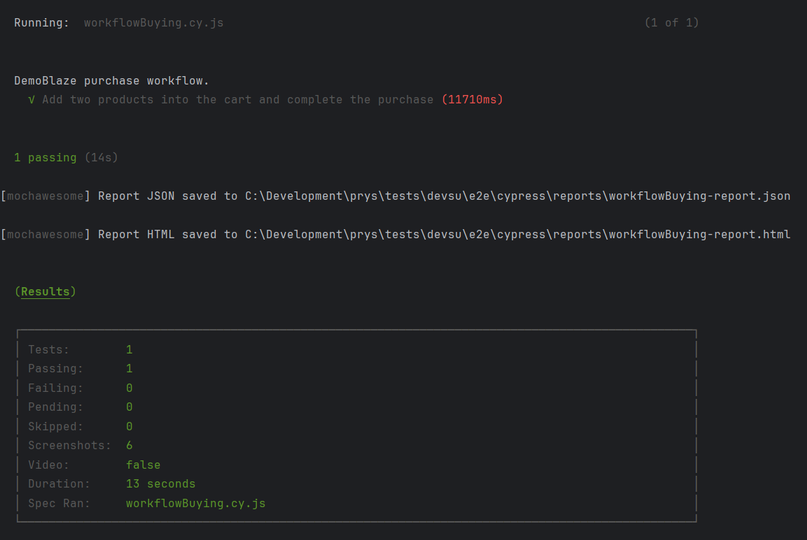
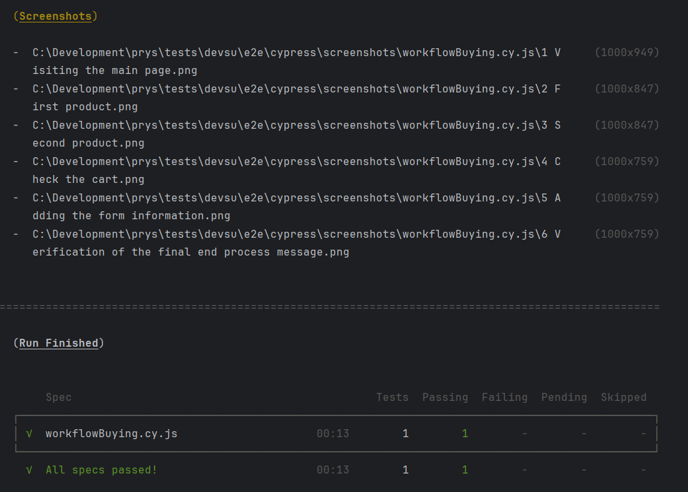

# AUTOMATIZACIÓN E2E
Esta prueba E2E permite validar el flujo siguiente:
- Visitar la página principal 
- Agregar dos productos al carrito de compra
- Visualizar el carrito de compra
- Completar el formulario de compra
- Finalizar la compra

## Implementación
Este flujo de prueba se ha implementado en un archivo que contiene los 4 escenarios, ubicado en:
[cypress/e2e/workflowBuying.cy.js](cypress/e2e/workflowBuying.cy.js)

## Instrucciones - Paso a pasa de ejecución
1. Ya en el repositorio:
``` /e2e/ ```
2. Ingresar al directorio **cypress**
``` cd cypress ```
3. Instalar Cypress en caso de no tenerlo activo:
   ``` npm install cypress --save-dev ```
4. Instalar mochawesome para la reportería:
``` 
npm install --save-dev mochawesome mochawesome-merge mochawesome-report-generator
 ```
5. Ejecución de la prueba:
``` npm run cy:run ```
6. Si desea ejecutar la prueba manualmente desde la herramienta Cypress:
``` 
npx cypress open 
Seleccione: E2E Testing
Seleccione: Edge
Clic en: Start E2E Testing in Edge
```
4. Revisión del reporte generado
   [cypress/reports/workflowBuying-report.html](cypress/reports/workflowBuying-report.html)
5. Revisión de las capturas de pantalla generados:
[Capturas](#capturas-de-pantalla)

## Archivos de configuración
Los parámetros de configuración de tiempos de respuesta, capturas y reportería están definidos en:
[cypress.config.js](cypress.config.js)

Los scripts de ejecución y dependencias están definidos en:
[package.json](package.json)

## Archivo fixture
Utiliza un archivo fixture con los datos de prueba usados en el test para fácil acceso y mantenimiento rápido, llamado:
[cypress/fixtures/data.json](cypress/fixtures/data.json)

## Reporte
Se ha creado un reporte visual para ver el estado de la última prueba realizada, ubicado en la ruta:
[cypress/reports/workflowBuying-report.html](cypress/reports/workflowBuying-report.html)

<figure>

<figure-caption>Reporte de la prueba.</figure-caption>
</figure>

## Capturas de pantalla
Se ha creado un directorio de captura de pantallas de la secuencia probada y también para cuando la prueba falle, ubicado en la ruta:
[/cypress/screenshots/workflowBuying.cy.js/](cypress/screenshots/workflowBuying.cy.js/)

Las capturas que se realizan son:
- [1 Visiting the main page.png](cypress/screenshots/workflowBuying.cy.js/1 Visiting the main page.png)
- [2 First product.png](cypress/screenshots/workflowBuying.cy.js/2 First product.png)
- [3 Second product.png](cypress/screenshots/workflowBuying.cy.js/3 Second product.png)
- [4 Check the cart.png](cypress/screenshots/workflowBuying.cy.js/4 Check the cart.png)
- [5 Adding the form information.png](cypress/screenshots/workflowBuying.cy.js/5 Adding the form information.png)
- [6 Verification of the final end process message.png](cypress/screenshots/workflowBuying.cy.js/6 Verification of the final end process message.png)

**1 Visiting the main page.png**


**2 First product.png**


**3 Second product.png**


**4 Check the cart.png**


**5 Adding the form information.png**


**6 Verification of the final end process message.png**


## Hallazgos y Concluciones
Para revisar los hallazgos y las conclusioines encontradas en estas pruebas revisar el archivo:
[conclusiones.txt](conclusiones.txt)

## Evidencias de ejecución vía consola
A continuaión se colocan las evidencias de la prueba ejecutada vía consola:

<figure>

</figure>

<figure>

</figure>

<figure>

<figure-caption>Evidencia de la prueba.</figure-caption>
</figure>


## Autor
Lugar y fecha: Quito, 20 de septiembre de 2025

Prueba y flujo definido por Andrés Rosero

Correo electrónico: andres.rosero@outlook.com

Contacto: +593 99 923 5692
